# 电磁态频谱语义化工程 - 代码依赖关系分析报告

**生成时间**: C:\Users\admin\custom_folder\donot\electromagneticState

**分析文件数**: 48

**分析错误数**: 0


---

## 1. 项目结构概览

```
electromagneticState/
├── src/                    # 源代码目录
│   ├── core/              # 核心模块（schemas, config）
│   ├── io/                # IO操作（文件读取）
│   ├── signal/            # 信号处理（频谱、干扰、拼接）
│   ├── semantics/         # 语义编码解码
│   ├── pipeline/          # 任务流水线
│   ├── visualization/     # 可视化工具
│   └── viz/               # 绘图辅助
├── tests/                 # 测试文件
├── docs/                  # 文档
├── data/                  # 数据目录
└── *.py                   # 顶层CLI脚本
```

## 2. 模块依赖层次

根据依赖关系，模块可分为以下层次：

```
Layer 0 (基础层):   core (schemas.py, config.py)
        ↓
Layer 1 (功能层):   io, signal, semantics
        ↓
Layer 2 (编排层):   pipeline
        ↓
Layer 3 (应用层):   CLI脚本 (spectrum_cli.py, etc.)
```

## 3. 核心模块详细分析

### 3.1 CORE 模块

#### config.py

**路径**: `src\core\config.py`

**第三方库依赖** (3):
  - `__future__`
  - `schemas`
  - `yaml`

**标准库依赖** (4):
  - dataclasses, json, pathlib, typing


#### schemas.py

**路径**: `src\core\schemas.py`

**第三方库依赖** (2):
  - `__future__`
  - `numpy`

**标准库依赖** (2):
  - dataclasses, typing


### 3.2 IO 模块

#### reader.py

**路径**: `src\io\reader.py`

**第三方库依赖** (5):
  - `__future__`
  - `core.schemas`
  - `glob`
  - `h5py`
  - `numpy`

**标准库依赖** (4):
  - enum, pathlib, re, typing


### 3.3 SIGNAL 模块

#### jammers.py

**路径**: `src\signal\jammers.py`

**第三方库依赖** (3):
  - `__future__`
  - `numpy`
  - `scipy.signal`

**标准库依赖** (2):
  - dataclasses, typing


#### segmentation.py

**路径**: `src\signal\segmentation.py`

**第三方库依赖** (4):
  - `__future__`
  - `core.config`
  - `core.schemas`
  - `numpy`

**标准库依赖** (1):
  - typing


#### spectrum.py

**路径**: `src\signal\spectrum.py`

**第三方库依赖** (5):
  - `__future__`
  - `core.schemas`
  - `numpy`
  - `scipy.signal`
  - `segmentation`

**标准库依赖** (1):
  - typing


#### spectrum_composer.py

**路径**: `src\signal\spectrum_composer.py`

**第三方库依赖** (4):
  - `__future__`
  - `jammers`
  - `numpy`
  - `spectrum`

**标准库依赖** (2):
  - dataclasses, typing


#### stitcher.py

**路径**: `src\signal\stitcher.py`

**第三方库依赖** (4):
  - `__future__`
  - `core.schemas`
  - `numpy`
  - `spectrum`

**标准库依赖** (5):
  - dataclasses, enum, pathlib, typing, warnings


### 3.4 SEMANTICS 模块

#### decode.py

**路径**: `src\semantics\decode.py`

**第三方库依赖** (3):
  - `__future__`
  - `core.schemas`
  - `numpy`

**标准库依赖** (3):
  - json, pathlib, typing


#### decode_multi.py

**路径**: `src\semantics\decode_multi.py`

**第三方库依赖** (4):
  - `__future__`
  - `core.schemas`
  - `decode`
  - `numpy`

**标准库依赖** (2):
  - pathlib, typing


#### decode_v2.py

**路径**: `src\semantics\decode_v2.py`

**第三方库依赖** (3):
  - `__future__`
  - `core.schemas`
  - `numpy`

**标准库依赖** (3):
  - json, pathlib, typing


#### edge_detect.py

**路径**: `src\semantics\edge_detect.py`

**第三方库依赖** (3):
  - `__future__`
  - `numpy`
  - `scipy.ndimage`

**标准库依赖** (1):
  - typing


### 3.5 PIPELINE 模块

#### analyze_comb.py

**路径**: `src\pipeline\analyze_comb.py`

**第三方库依赖** (6):
  - `__future__`
  - `core.schemas`
  - `matplotlib.pyplot`
  - `numpy`
  - `signal.spectrum`
  - `viz.plots`

**标准库依赖** (4):
  - argparse, pathlib, sys, typing


#### compose_spectrum.py

**路径**: `src\pipeline\compose_spectrum.py`

**第三方库依赖** (4):
  - `__future__`
  - `matplotlib.pyplot`
  - `numpy`
  - `signal.spectrum_composer`

**标准库依赖** (5):
  - argparse, io, json, pathlib, sys


#### demo_resolution.py

**路径**: `src\pipeline\demo_resolution.py`

**第三方库依赖** (6):
  - `__future__`
  - `core.schemas`
  - `matplotlib.pyplot`
  - `numpy`
  - `signal.spectrum`
  - `viz.plots`

**标准库依赖** (3):
  - argparse, pathlib, sys


#### generate_jammers.py

**路径**: `src\pipeline\generate_jammers.py`

**第三方库依赖** (5):
  - `__future__`
  - `matplotlib.pyplot`
  - `numpy`
  - `scipy.signal`
  - `signal.jammers`

**标准库依赖** (4):
  - argparse, pathlib, sys, typing


#### interactive_cli.py

**路径**: `src\pipeline\interactive_cli.py`

**第三方库依赖** (9):
  - `__future__`
  - `core.config`
  - `core.schemas`
  - `numpy`
  - `pipeline.semantic_eval`
  - `semantics.decode`
  - `signal.spectrum`
  - `signal.spectrum_composer`
  - `signal.stitcher`

**标准库依赖** (5):
  - dataclasses, io, pathlib, sys, typing


#### jammer_demo.py

**路径**: `src\pipeline\jammer_demo.py`

**第三方库依赖** (7):
  - `__future__`
  - `core.schemas`
  - `matplotlib.pyplot`
  - `numpy`
  - `signal.jammers`
  - `signal.spectrum`
  - `viz.plots`

**标准库依赖** (3):
  - argparse, pathlib, sys


#### overlay_comb.py

**路径**: `src\pipeline\overlay_comb.py`

**第三方库依赖** (5):
  - `__future__`
  - `core.schemas`
  - `matplotlib.pyplot`
  - `numpy`
  - `signal.spectrum`

**标准库依赖** (3):
  - argparse, pathlib, sys


#### semantic_eval.py

**路径**: `src\pipeline\semantic_eval.py`

**第三方库依赖** (3):
  - `__future__`
  - `numpy`
  - `semantics.decode_multi`

**标准库依赖** (5):
  - argparse, io, json, pathlib, sys


#### semantic_eval_v2.py

**路径**: `src\pipeline\semantic_eval_v2.py`

**第三方库依赖** (5):
  - `__future__`
  - `numpy`
  - `pipeline.semantic_eval`
  - `semantic_eval`
  - `semantics.decode_v2`

**标准库依赖** (5):
  - argparse, io, json, pathlib, sys


#### semantic_generate.py

**路径**: `src\pipeline\semantic_generate.py`

**第三方库依赖** (2):
  - `__future__`
  - `numpy`

**标准库依赖** (7):
  - argparse, dataclasses, io, json, pathlib, sys, typing


#### semantic_plot.py

**路径**: `src\pipeline\semantic_plot.py`

**第三方库依赖** (4):
  - `__future__`
  - `matplotlib.pyplot`
  - `numpy`
  - `semantics.decode`

**标准库依赖** (3):
  - argparse, pathlib, sys


#### simulate_iq.py

**路径**: `src\pipeline\simulate_iq.py`

**第三方库依赖** (7):
  - `__future__`
  - `core.config`
  - `core.schemas`
  - `matplotlib.pyplot`
  - `numpy`
  - `signal.spectrum`
  - `viz.plots`

**标准库依赖** (4):
  - argparse, pathlib, sys, typing


#### stitch_multi.py

**路径**: `src\pipeline\stitch_multi.py`

**第三方库依赖** (6):
  - `__future__`
  - `core.config`
  - `core.schemas`
  - `matplotlib.pyplot`
  - `numpy`
  - `signal.spectrum`

**标准库依赖** (6):
  - argparse, io, pathlib, re, sys, typing


#### stitch_real_data.py

**路径**: `src\pipeline\stitch_real_data.py`

**第三方库依赖** (6):
  - `__future__`
  - `core.schemas`
  - `matplotlib.pyplot`
  - `numpy`
  - `signal.spectrum`
  - `signal.stitcher`

**标准库依赖** (5):
  - argparse, io, io.reader, pathlib, sys


### 3.6 VISUALIZATION 模块

#### __init__.py

**路径**: `src\visualization\__init__.py`

**第三方库依赖** (1):
  - `spectrum_plot`


#### spectrum_plot.py

**路径**: `src\visualization\spectrum_plot.py`

**第三方库依赖** (5):
  - `__future__`
  - `matplotlib.patches`
  - `matplotlib.pyplot`
  - `matplotlib.ticker`
  - `numpy`

**标准库依赖** (3):
  - enum, pathlib, typing


#### plots.py

**路径**: `src\viz\plots.py`

**第三方库依赖** (4):
  - `__future__`
  - `matplotlib`
  - `matplotlib.pyplot`
  - `numpy`

**标准库依赖** (1):
  - typing


### 3.7 SCRIPTS 模块

#### analyze_dependencies.py

**路径**: `analyze_dependencies.py`

**标准库依赖** (7):
  - ast, collections, io, json, pathlib, sys, typing


#### analyze_real_iq.py

**路径**: `analyze_real_iq.py`

**项目内部依赖** (1):
  - `src.io.reader`

**第三方库依赖** (2):
  - `matplotlib.pyplot`
  - `numpy`

**标准库依赖** (2):
  - pathlib, sys


#### analyze_real_spectrum.py

**路径**: `analyze_real_spectrum.py`

**第三方库依赖** (2):
  - `matplotlib.pyplot`
  - `numpy`

**标准库依赖** (2):
  - pathlib, sys


#### demo_all_tasks.py

**路径**: `demo_all_tasks.py`

**项目内部依赖** (4):
  - `src.core.schemas`
  - `src.semantics.decode`
  - `src.signal.spectrum_composer`
  - `src.signal.stitcher`

**第三方库依赖** (4):
  - `__future__`
  - `matplotlib.pyplot`
  - `numpy`
  - `traceback`

**标准库依赖** (4):
  - io, json, pathlib, sys


#### demo_delivery.py

**路径**: `demo_delivery.py`

**项目内部依赖** (5):
  - `src.core.schemas`
  - `src.semantics.decode`
  - `src.signal.spectrum_composer`
  - `src.signal.stitcher`
  - `src.visualization.spectrum_plot`

**第三方库依赖** (2):
  - `__future__`
  - `numpy`

**标准库依赖** (3):
  - os, pathlib, sys


#### spectrum_batch.py

**路径**: `spectrum_batch.py`

**项目内部依赖** (8):
  - `src.core.schemas`
  - `src.io.reader`
  - `src.pipeline.stitch_real_data`
  - `src.semantics.decode`
  - `src.semantics.decode_multi`
  - `src.semantics.decode_v2`
  - `src.signal.spectrum_composer`
  - `src.signal.stitcher`

**第三方库依赖** (4):
  - `__future__`
  - `matplotlib.pyplot`
  - `numpy`
  - `traceback`

**标准库依赖** (4):
  - argparse, json, pathlib, sys


#### spectrum_cli.py

**路径**: `spectrum_cli.py`

**项目内部依赖** (6):
  - `src.core.schemas`
  - `src.io.reader`
  - `src.pipeline.stitch_real_data`
  - `src.semantics.decode`
  - `src.signal.spectrum_composer`
  - `src.signal.stitcher`

**第三方库依赖** (4):
  - `__future__`
  - `matplotlib.pyplot`
  - `numpy`
  - `traceback`

**标准库依赖** (6):
  - io, json, os, pathlib, sys, typing


#### test_multi_region.py

**路径**: `test_multi_region.py`

**项目内部依赖** (3):
  - `src.core.schemas`
  - `src.semantics.decode_multi`
  - `src.visualization.spectrum_plot`

**第三方库依赖** (2):
  - `matplotlib.pyplot`
  - `numpy`

**标准库依赖** (3):
  - os, pathlib, sys


#### test_task2_create_bins.py

**路径**: `test_task2_create_bins.py`

**项目内部依赖** (1):
  - `src.signal.jammers`

**第三方库依赖** (2):
  - `__future__`
  - `numpy`

**标准库依赖** (3):
  - io, pathlib, sys


#### conftest.py

**路径**: `tests\conftest.py`

**标准库依赖** (2):
  - pathlib, sys


#### test_cli_bin_support.py

**路径**: `tests\test_cli_bin_support.py`

**项目内部依赖** (3):
  - `src.io.reader`
  - `src.pipeline.stitch_real_data`
  - `src.signal.stitcher`

**第三方库依赖** (5):
  - `__future__`
  - `numpy`
  - `pipeline.stitch_real_data`
  - `signal.stitcher`
  - `traceback`

**标准库依赖** (3):
  - io.reader, pathlib, sys


#### test_core_fixes.py

**路径**: `tests\test_core_fixes.py`

**项目内部依赖** (6):
  - `src.core.schemas`
  - `src.semantics.decode`
  - `src.semantics.edge_detect`
  - `src.signal.jammers`
  - `src.signal.spectrum_composer`
  - `src.signal.stitcher`

**第三方库依赖** (2):
  - `numpy`
  - `pytest`

**标准库依赖** (2):
  - pathlib, sys


#### test_io_reader.py

**路径**: `tests\test_io_reader.py`

**项目内部依赖** (1):
  - `src.io.reader`

**第三方库依赖** (2):
  - `h5py`
  - `numpy`

**标准库依赖** (1):
  - pathlib


#### test_pipeline_semantic_eval.py

**路径**: `tests\test_pipeline_semantic_eval.py`

**项目内部依赖** (3):
  - `src.core.schemas`
  - `src.pipeline.semantic_eval`
  - `src.semantics.decode`

**第三方库依赖** (1):
  - `numpy`

**标准库依赖** (2):
  - json, sys


#### test_segmentation.py

**路径**: `tests\test_segmentation.py`

**项目内部依赖** (2):
  - `src.core.schemas`
  - `src.signal.segmentation`

**第三方库依赖** (1):
  - `numpy`


#### test_semantics.py

**路径**: `tests\test_semantics.py`

**项目内部依赖** (2):
  - `src.core.schemas`
  - `src.semantics.decode`

**第三方库依赖** (1):
  - `numpy`


#### test_semantics_multi_region.py

**路径**: `tests\test_semantics_multi_region.py`

**项目内部依赖** (4):
  - `src.core.schemas`
  - `src.semantics.decode`
  - `src.semantics.decode_multi`
  - `src.semantics.edge_detect`

**第三方库依赖** (1):
  - `numpy`


#### test_semantics_v2.py

**路径**: `tests\test_semantics_v2.py`

**项目内部依赖** (2):
  - `src.core.schemas`
  - `src.semantics.decode_v2`

**第三方库依赖** (1):
  - `numpy`

**标准库依赖** (2):
  - json, pathlib


#### test_spectrum.py

**路径**: `tests\test_spectrum.py`

**项目内部依赖** (2):
  - `src.core.schemas`
  - `src.signal.spectrum`

**第三方库依赖** (1):
  - `numpy`


## 4. 依赖关系统计

### 4.1 依赖类型分布

| 依赖类型 | 数量 |
|---------|------|
| 标准库 | 142 |
| 第三方库 | 165 |
| 项目内部 | 53 |

### 4.2 最常用的第三方库（Top 10）

| 库名 | 使用次数 |
|------|---------|
| numpy | 44 |
| __future__ | 34 |
| matplotlib | 21 |
| core | 19 |
| signal | 15 |
| traceback | 4 |
| viz | 4 |
| scipy | 4 |
| semantics | 4 |
| pipeline | 3 |

## 5. 关键依赖路径分析

### 5.1 核心数据结构（src/core/schemas.py）的被依赖情况

被 28 个文件依赖:

  - `demo_all_tasks.py`
  - `demo_delivery.py`
  - `spectrum_batch.py`
  - `spectrum_cli.py`
  - `src\core\config.py`
  - `src\io\reader.py`
  - `src\pipeline\analyze_comb.py`
  - `src\pipeline\demo_resolution.py`
  - `src\pipeline\interactive_cli.py`
  - `src\pipeline\jammer_demo.py`
  - `src\pipeline\overlay_comb.py`
  - `src\pipeline\simulate_iq.py`
  - `src\pipeline\stitch_multi.py`
  - `src\pipeline\stitch_real_data.py`
  - `src\semantics\decode.py`
  - `src\semantics\decode_multi.py`
  - `src\semantics\decode_v2.py`
  - `src\signal\segmentation.py`
  - `src\signal\spectrum.py`
  - `src\signal\stitcher.py`
  - `test_multi_region.py`
  - `tests\test_core_fixes.py`
  - `tests\test_pipeline_semantic_eval.py`
  - `tests\test_segmentation.py`
  - `tests\test_semantics.py`
  - `tests\test_semantics_multi_region.py`
  - `tests\test_semantics_v2.py`
  - `tests\test_spectrum.py`

## 6. 潜在问题与建议

### 6.2 依赖建议

- ✅ 模块层次清晰：core → io/signal/semantics → pipeline → CLI
- ✅ 核心模块（core）被广泛使用，符合设计
- ⚠️  建议定期检查是否存在循环依赖
- ⚠️  pipeline模块文件较多，可考虑进一步分组

## 7. 总结

本项目依赖关系清晰，模块职责明确：

- **core**: 提供数据结构和配置
- **io**: 处理文件读写
- **signal**: 实现信号处理算法
- **semantics**: 语义编码解码
- **pipeline**: 组合上述模块完成完整任务
- **CLI**: 提供用户接口

整体架构符合分层设计原则，便于维护和扩展。


---

## 8. 依赖关系可视化

### 8.1 模块层次依赖图

```mermaid
graph TB

    %% 定义样式
    classDef coreStyle fill:#e1f5fe,stroke:#01579b,stroke-width:2px
    classDef ioStyle fill:#f3e5f5,stroke:#4a148c,stroke-width:2px
    classDef signalStyle fill:#e8f5e9,stroke:#1b5e20,stroke-width:2px
    classDef semanticsStyle fill:#fff3e0,stroke:#e65100,stroke-width:2px
    classDef pipelineStyle fill:#fce4ec,stroke:#880e4f,stroke-width:2px
    classDef vizStyle fill:#f1f8e9,stroke:#33691e,stroke-width:2px
    classDef scriptStyle fill:#eceff1,stroke:#263238,stroke-width:2px

    %% 核心模块 (Layer 0)
    src_core_config[config]:::coreStyle
    src_core_schemas[schemas]:::coreStyle

    %% 功能层模块 (Layer 1)
    src_io_reader[reader]:::ioStyle
    src_signal_jammers[jammers]:::signalStyle
    src_signal_segmentation[segmentation]:::signalStyle
    src_signal_spectrum[spectrum]:::signalStyle
    src_signal_spectrum_composer[spectrum_composer]:::signalStyle
    src_signal_stitcher[stitcher]:::signalStyle
    src_semantics_decode[decode]:::semanticsStyle
    src_semantics_decode_multi[decode_multi]:::semanticsStyle
    src_semantics_decode_v2[decode_v2]:::semanticsStyle
    src_semantics_edge_detect[edge_detect]:::semanticsStyle

    %% Pipeline层 (Layer 2)
    src_pipeline_analyze_comb[analyze_comb]:::pipelineStyle
    src_pipeline_compose_spectrum[compose_spectrum]:::pipelineStyle
    src_pipeline_demo_resolution[demo_resolution]:::pipelineStyle
    src_pipeline_generate_jammers[generate_jammers]:::pipelineStyle
    src_pipeline_interactive_cli[interactive_cli]:::pipelineStyle
    pipeline_more[...more pipeline files]:::pipelineStyle

    %% CLI应用层 (Layer 3)
    analyze_real_spectrum[analyze_real_spectrum]:::scriptStyle

    %% 关键依赖关系
    src_core_config --> src_io_reader
    src_core_config --> src_signal_jammers
    src_core_config --> src_semantics_decode
    src_signal_jammers --> src_pipeline_analyze_comb
    src_semantics_decode --> src_pipeline_analyze_comb
    src_pipeline_analyze_comb --> analyze_real_spectrum
```




## 模块文件统计

| 模块 | 文件数 | 说明 |
|------|--------|------|
| core | 2 | 核心数据结构与配置 |
| io | 1 | IO文件读写 |
| pipeline | 14 | 任务流水线编排 |
| script | 19 | CLI脚本与工具 |
| semantics | 4 | 语义编码解码 |
| signal | 5 | 信号处理与频谱分析 |
| visualization | 2 | 可视化工具 |
| viz | 1 | 绘图辅助 |

**总计**: 48 个Python文件
